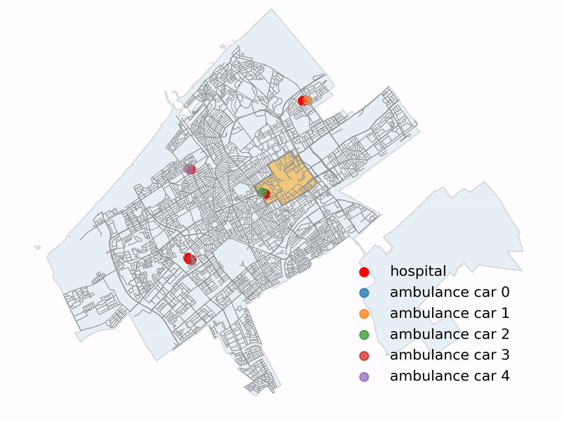

# osmnx-matplotlib-animation
A simple example of how to animate cars riding on OSMnx graph

## Motivation
Create a simple minimalistic animation of an object (e.g. car, citizen) moving on OSMnx or NetworkX graph object (street network) using matplotlib syntax. 

An alternative that is worth mentioning is [streamlit](https://github.com/streamlit/streamlit). It is much more powerful, allows you to use controls and looks fancier :-) The drawback is its syntax and the way how it works with matplotlib (GeoPandas) objects (my application was too slow). If you know better ways to animate this task, please, ping [me](https://twitter.com/mikhailsirenko) on Twitter.

## Example
The example in `main.ipynb` describes a ride of 5 ambulance cars from 5 hospitals in The Hague to a district called Centrum. To get from the origins to destinations cars use the shortest paths. They start the ride at the same time, but since the route lengths are different, some of them arrive earlier.

In OSXMnx and matplotlib "language", we first define origin (O) and destination (D) points: hospital coordinates and a Centrum district centroid; second, we calculate the shortest paths from O to D; thereafter, extract coordinates of the nodes of derived shortest paths; finally, sequentially plotting each of the coordinate pairs using matplotlib FuncAnimation.

  

## Data used
The data sets used in this example:
1. city.json: The Hague city shapefile;
2. districts.json: The Hague districts shapefile;
3. hospitals.json: Hospital locations;
4. graph.graphml: The Hague street network derived with OSMnx graph_from_point function.

## Use cases
You can easily fine-tune this notebook for your case study: just think in terms of origins and destinations. For example, instead of ambulance cars, you want to animate citizens walking from their homes to supermarkets. No problem! Define where the citizens live with (replace hospitals.json), where the supermarkets are located (replace districts.json), get new graph.graphml file with OSMnx, finally, configure the variable names in the notebook to avoid confusion. Now you can rerun the notebook and voila your animation is created!
